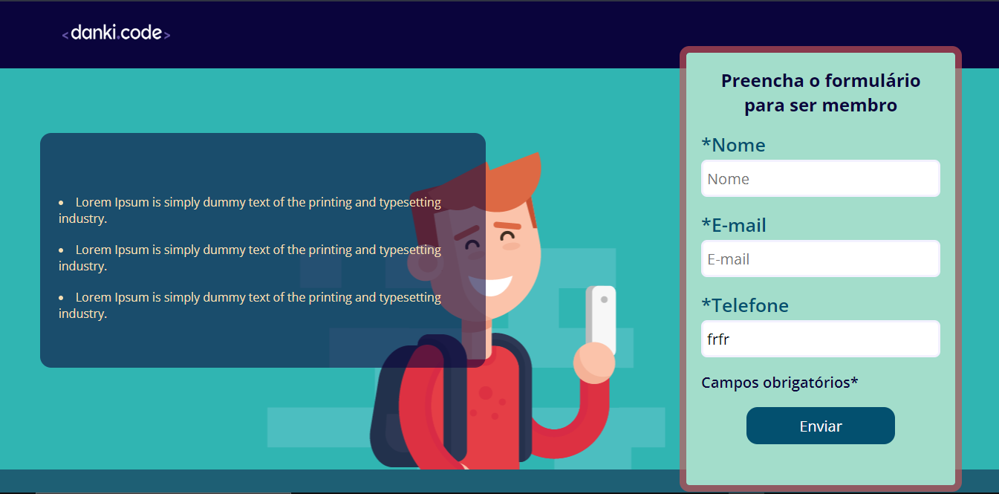
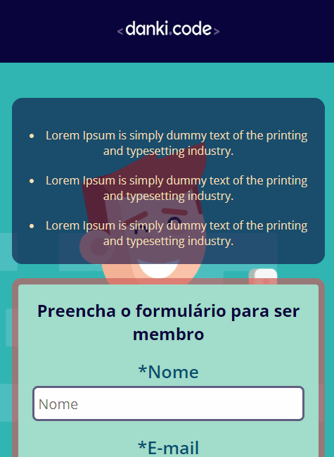
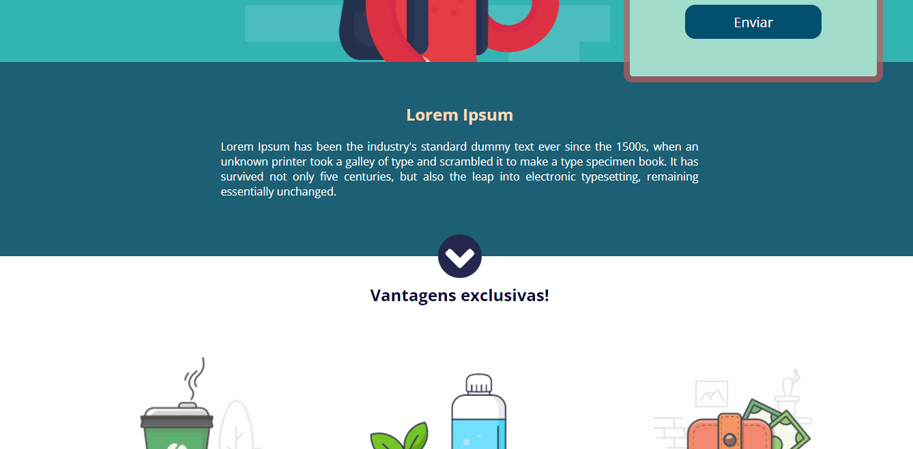
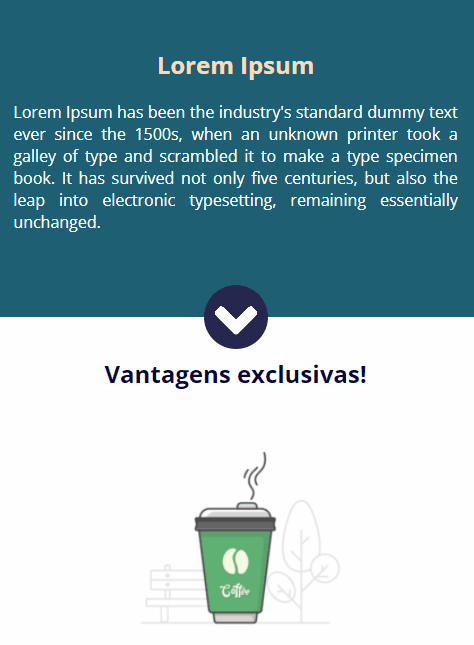

# Landing Page

O intuito desse projeto foi aplicar propriedades simples de marcação do HTML e estilização do CSS para a criação de uma landing page estática e utilização de media queries para o responsivo do site

<a target="_blank" style="text-decoration: none; color: black;background-color: white; padding: 5px 5px; border-radius: 2px;" href="https://joaoparaujocr.github.io/landing-pag/">Link para a visualização do projeto</a>

# Imagens do Projeto

    
Formulário

    
    

    
Sessões e Rodapé

    
    

# Tecnologias

    
    

